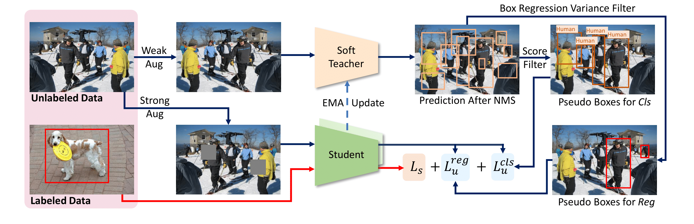

# End-to-End Semi-Supervised Object Detection with Soft Teacher

[](https://paperswithcode.com/sota/semi-supervised-object-detection-on-coco-1?p=end-to-end-semi-supervised-object-detection)
[](https://paperswithcode.com/sota/semi-supervised-object-detection-on-coco-5?p=end-to-end-semi-supervised-object-detection)
[](https://paperswithcode.com/sota/semi-supervised-object-detection-on-coco-10?p=end-to-end-semi-supervised-object-detection)
[](https://paperswithcode.com/sota/instance-segmentation-on-coco-minival?p=end-to-end-semi-supervised-object-detection)
[](https://paperswithcode.com/sota/object-detection-on-coco-minival?p=end-to-end-semi-supervised-object-detection)
[](https://paperswithcode.com/sota/instance-segmentation-on-coco?p=end-to-end-semi-supervised-object-detection)
[](https://paperswithcode.com/sota/object-detection-on-coco?p=end-to-end-semi-supervised-object-detection)

By [Mengde Xu*](https://scholar.google.com/citations?user=C04zJHEAAAAJ&hl=zh-CN), [Zheng Zhang*](https://github.com/stupidZZ), [Han Hu](https://github.com/ancientmooner), [Jianfeng Wang](https://github.com/amsword), [Lijuan Wang](https://www.microsoft.com/en-us/research/people/lijuanw/), [Fangyun Wei](https://scholar.google.com.tw/citations?user=-ncz2s8AAAAJ&hl=zh-TW), [Xiang Bai](http://cloud.eic.hust.edu.cn:8071/~xbai/), [Zicheng Liu](https://www.microsoft.com/en-us/research/people/zliu/).


This repo is the official implementation of ["End-to-End Semi-Supervised Object Detection with Soft Teacher"](https://arxiv.org/abs/2106.09018).

## Citation

```bib
@article{xu2021end,
  title={End-to-End Semi-Supervised Object Detection with Soft Teacher},
  author={Xu, Mengde and Zhang, Zheng and Hu, Han and Wang, Jianfeng and Wang, Lijuan and Wei, Fangyun and Bai, Xiang and Liu, Zicheng},
  journal={arXiv preprint arXiv:2106.09018},
  year={2021}
}
```

## Main Results

### Partial Labeled Data

We followed STAC[1] to evalutate on 5 different data splits for each settings, and report the average performance of 5 splits. The results are shown in the following:

#### 1% labeled data
| Method | mAP| Model Weights |Config Files|
| ---- | -------| ----- |----|
| Baseline|  10.0 |-|[Config](configs/baseline/faster_rcnn_r50_caffe_fpn_coco_partial_180k.py)|
| Ours (thr=5e-2)   | 21.62 |[Drive](https://drive.google.com/drive/folders/1QA8sAw49DJiMHF-Cr7q0j7KgKjlJyklV?usp=sharing)|[Config](configs/soft_teacher/soft_teacher_faster_rcnn_r50_caffe_fpn_coco_180k.py)|
| Ours (thr=1e-3)|22.64| [Drive](https://drive.google.com/drive/folders/1QA8sAw49DJiMHF-Cr7q0j7KgKjlJyklV?usp=sharing)|[Config](configs/soft_teacher/soft_teacher_faster_rcnn_r50_caffe_fpn_coco_180k.py)|

#### 5% labeled data
| Method | mAP| Model Weights |Config Files|
| ---- | -------| ----- |----|
| Baseline|  20.92 |-|[Config](configs/baseline/faster_rcnn_r50_caffe_fpn_coco_partial_180k.py)|
| Ours (thr=5e-2)   | 30.42 |[Drive](https://drive.google.com/drive/folders/1FBWj5SB888m0LU_XYUOK9QEgiubSbU-8?usp=sharing)|[Config](configs/soft_teacher/soft_teacher_faster_rcnn_r50_caffe_fpn_coco_180k.py)|
| Ours (thr=1e-3)|31.7| [Drive](https://drive.google.com/drive/folders/1FBWj5SB888m0LU_XYUOK9QEgiubSbU-8?usp=sharing)|[Config](configs/soft_teacher/soft_teacher_faster_rcnn_r50_caffe_fpn_coco_180k.py)|

#### 10% labeled data
| Method | mAP| Model Weights |Config Files|
| ---- | -------| ----- |----|
| Baseline|  26.94 |-|[Config](configs/baseline/faster_rcnn_r50_caffe_fpn_coco_partial_180k.py)|
| Ours (thr=5e-2)   | 33.78 |[Drive](https://drive.google.com/drive/folders/1WyAVpfnWxEgvxCLUesxzNB81fM_de9DI?usp=sharing)|[Config](configs/soft_teacher/soft_teacher_faster_rcnn_r50_caffe_fpn_coco_180k.py)|
| Ours (thr=1e-3)|34.7| [Drive](https://drive.google.com/drive/folders/1WyAVpfnWxEgvxCLUesxzNB81fM_de9DI?usp=sharing)|[Config](configs/soft_teacher/soft_teacher_faster_rcnn_r50_caffe_fpn_coco_180k.py)|

### Full Labeled Data

#### Faster R-CNN (ResNet-50)
| Model | mAP| Model Weights |Config Files|
| ------ |--- | ----- |----|
| Baseline |  40.9 | - | [Config](configs/baseline/faster_rcnn_r50_caffe_fpn_coco_full_720k.py) |
| Ours (thr=5e-2) | 44.05 |[Drive](https://drive.google.com/file/d/1QSwAcU1dpmqVkJiXufW_QaQu-puOeblG/view?usp=sharing)|[Config](configs/soft_teacher/soft_teacher_faster_rcnn_r50_caffe_fpn_coco_full_720k.py)|
| Ours (thr=1e-3) | 44.6 |[Drive](https://drive.google.com/file/d/1QSwAcU1dpmqVkJiXufW_QaQu-puOeblG/view?usp=sharing)|[Config](configs/soft_teacher/soft_teacher_faster_rcnn_r50_caffe_fpn_coco_full_720k.py)|
| Ours* (thr=5e-2) | 44.5 | - | [Config](configs/soft_teacher/soft_teacher_faster_rcnn_r50_caffe_fpn_coco_full_1440k.py) |
| Ours* (thr=1e-3) |  44.9 | - | [Config](configs/soft_teacher/soft_teacher_faster_rcnn_r50_caffe_fpn_coco_full_1440k.py) |

####  Faster R-CNN (ResNet-101)
| Model | mAP| Model Weights |Config Files|
| ------ |--- | ----- |----|
| Baseline |  43.8 | -   | [Config](configs/baseline/faster_rcnn_r101_caffe_fpn_coco_full_720k.py) |
| Ours* (thr=5e-2) |  46.8 | - |[Config](configs/soft_teacher/soft_teacher_faster_rcnn_r101_caffe_fpn_coco_full_1080k.py) |
| Ours* (thr=1e-3) |  47.3 | - | [Config](configs/soft_teacher/soft_teacher_faster_rcnn_r101_caffe_fpn_coco_full_1080k.py) |


### Notes
- Ours* means we use longger training schedule.
- `thr` indicates `model.test_cfg.rcnn.score_thr` in config files. This inference trick was first introduced by Instant-Teaching[2].
- All models are trained on 8*V100 GPUs

## Usage

### Requirements
- `Ubuntu 16.04`
- `Anaconda3` with `python=3.6`
- `Pytorch=1.9.0`
- `mmdetection=2.16.0+fe46ffe`
- `mmcv=1.3.9`
- `wandb=0.10.31`

#### Notes
- We use [wandb](https://wandb.ai/) for visualization, if you don't want to use it, just comment line `276-289` in `configs/soft_teacher/base.py`.

### Installation
```
make install
```

### Data Preparation
- Download the COCO dataset
- Execute the following command to generate data set splits:
```shell script
# YOUR_DATA should be a directory contains coco dataset.
# For eg.:
# YOUR_DATA/
#  coco/
#     train2017/
#     val2017/
#     unlabeled2017/
#     annotations/ 
ln -s ${YOUR_DATA} data
bash tools/dataset/prepare_coco_data.sh conduct

```

### Training
- To train model on the **partial labeled data** setting:
```shell script
# JOB_TYPE: 'baseline' or 'semi', decide which kind of job to run
# PERCENT_LABELED_DATA: 1, 5, 10. The ratio of labeled coco data in whole training dataset.
# GPU_NUM: number of gpus to run the job
for FOLD in 1 2 3 4 5;
do
  bash tools/dist_train_partially.sh <JOB_TYPE> ${FOLD} <PERCENT_LABELED_DATA> <GPU_NUM>
done
```
For example, we could run the following scripts to train our model on 10% labeled data with 8 GPUs:

```shell script
for FOLD in 1 2 3 4 5;
do
  bash tools/dist_train_partially.sh semi ${FOLD} 10 8
done
```

- To train model on the **full labeled data** setting:
```shell script
bash tools/dist_train.sh <CONFIG_FILE_PATH> <NUM_GPUS>
```
For example, to train ours `R50` model with 8 GPUs:
```shell script
bash tools/dist_train.sh configs/soft_teacher/soft_teacher_faster_rcnn_r50_caffe_fpn_coco_full_720k.py 8
```


### Inference
```
bash tools/dist_test.sh <CONFIG_FILE_PATH> <CHECKPOINT_PATH> <NUM_GPUS> --eval bbox --cfg-options model.test_cfg.rcnn.score_thr=<THR>
```

[1] [A Simple Semi-Supervised Learning Framework for Object Detection](https://arxiv.org/pdf/2005.04757.pdf) 


[2] [Instant-Teaching: An End-to-End Semi-Supervised
Object Detection Framework](https://arxiv.org/pdf/2103.11402.pdf)

